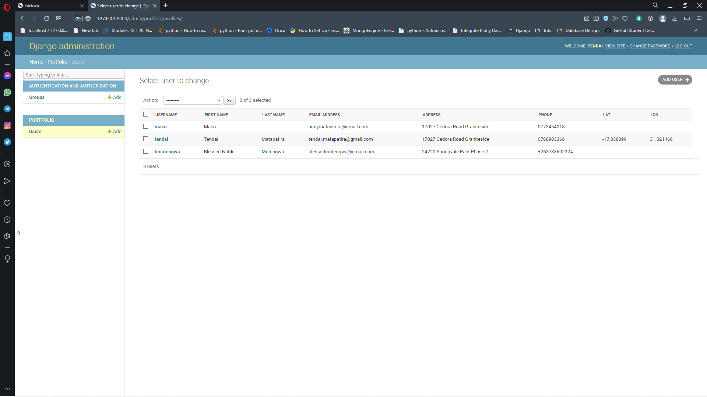

# Kartoza Application
Done by Blessed Mutengwa, blessedmutengwa@gmail.com

## Requirements
To be able to run the Application on a local machine, please run the following command without quotes to install the application dependencies and supporting apps: 
__"python -m pip install -r requirements.txt"__

## Database
You will need to have installed MySql Database and Xampp application to view database instances using a GUI.  Amongst other database applications which include __data warehousing, data store, web applications, mobile, analytics applications__ it is also preferred to handle Geospatial data, which is why it was selected as a database for this application and doesn't require installation of GDAL to work with geo-django or django-gis packages.

## Run Application
To run the application, you will need to locate the root directory for the project and: 
1. Migrate the database - type in the terminal the following command without quotes -> python manage.py migrate
2. Run the application server - type in the terminal the following command without quotes -> python manage.py runserver
3. To check if there are any warnings or errors - type in the terminal the following command without quotes -> python manage.py check

## Application Screenshots  
### Database [User Table]

### Application [Login Page]

### Application [Signup Page]

### Application [Logged Out]

### Application [Home Page for a user who is also a superuser]
#### _Application Routes has Url for logged-in user current profile and Url for All users since the logged-in user is a super-user_

### Application [User Profile]

### Application [User Profile - Where a user can edit their profile]

